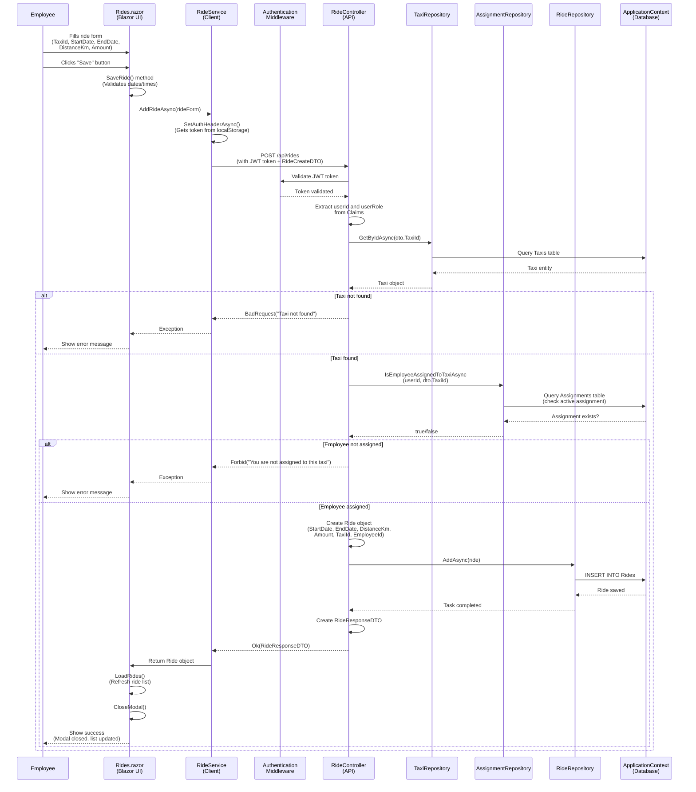

# Sequence Diagram: Employee Adds a New Ride

## Components Involved

1. **Rides.razor**: Blazor UI component where employee fills the form
2. **RideService**: Client-side service that handles HTTP requests
3. **Authentication Middleware**: Validates JWT token
4. **RideController**: API controller handling the POST request
5. **TaxiRepository**: Repository for taxi data access
6. **AssignmentRepository**: Repository for assignment validation
7. **RideRepository**: Repository for ride data access
8. **ApplicationContext**: Entity Framework database context

## Key Validations

- Employee must be authenticated (JWT token required)
- Taxi must exist in the database
- Employee must be assigned to the taxi (active assignment with EndDate = null)
- All ride data must be provided (StartDate, EndDate, DistanceKm, Amount, TaxiId)

