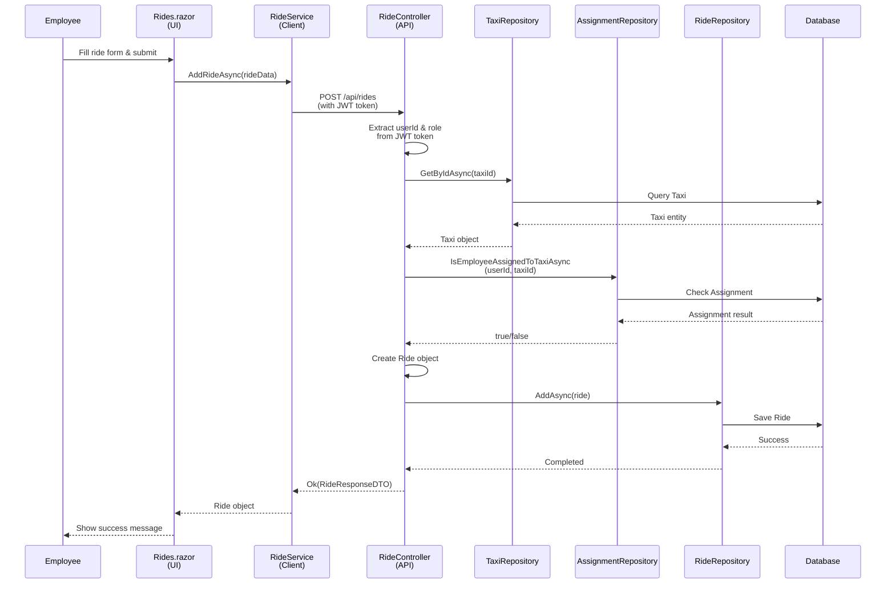

# Sequence Diagram: Employee Adds a New Ride (Simplified)

## Key Actors & Objects

- **Employee**: The user adding the ride
- **UI (Rides.razor)**: Blazor component for ride form
- **RideService**: Client-side service handling HTTP requests
- **RideController**: API endpoint handling ride creation
- **TaxiRepository**: Validates taxi exists
- **AssignmentRepository**: Validates employee assignment
- **RideRepository**: Saves the ride to database
- **Database**: Data persistence layer

